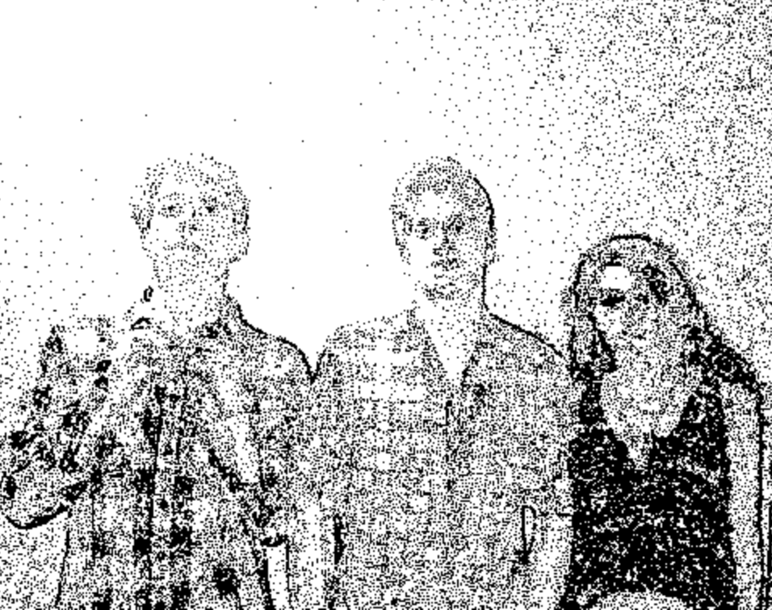
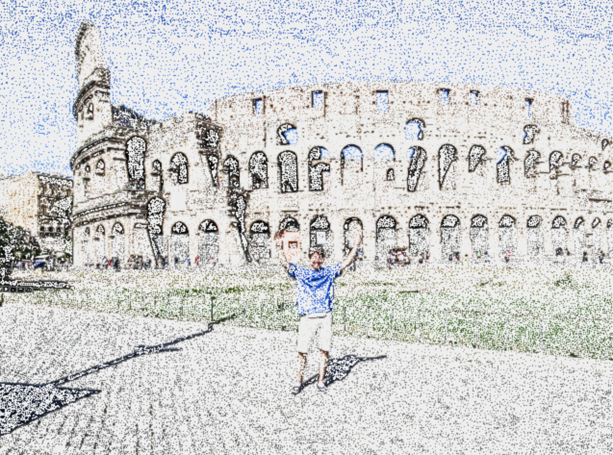

Dotify
======

It's all in the name. Dotify pictures of your friends, your family, and especially your cat.

Dotify is a pretty neat image manipulation tool that I built entirely with Java and Swing.
In a nutshell it uses a variation of Dijkstra's algorithm and leverages both the darkness value and the
gradient difference in darkness between adjacent pixels to calculate path lengths. It compares the path 
length with a threshold and when this threshold is surpassed, it places a stipple (dot) in the image.  Each 
time a stipple is placed, the interior path length is set to zero and the process repeats until every pixel
in the image has been visited.

Its pretty cool to watch dotify draw your pictures live (although it may take a hot minute) so if you are interested in adding features
or just playing around with some of your own photos fork, clone, or download the executable jar to try it yourself.

You've definitely got to see it to believe it so here are few dotified friends, family, and pets.

Check It Out
============

