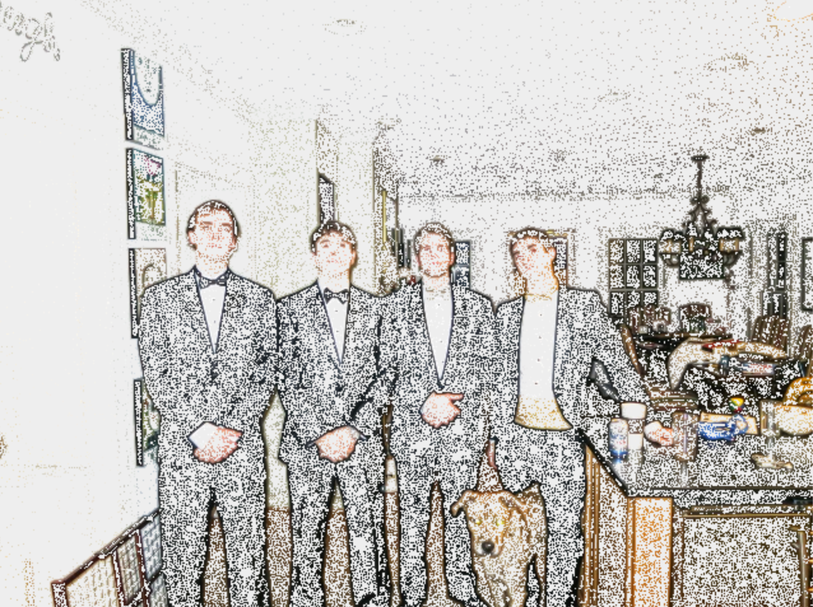
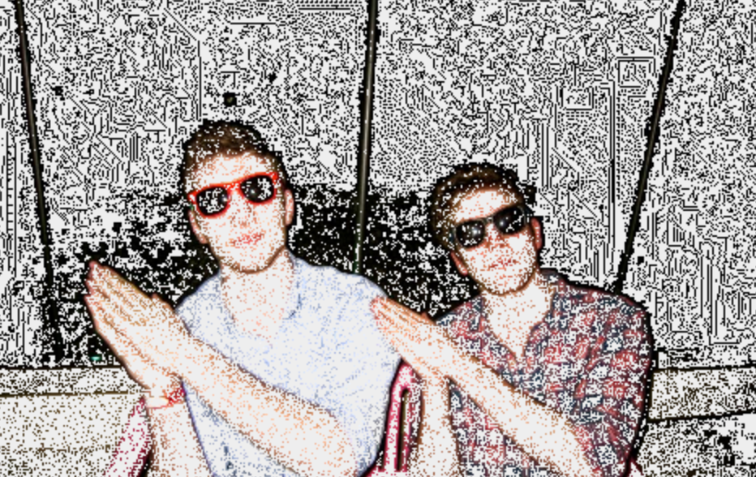

Dotify
======

It's all in the name. Dotify pictures of your friends, your family, and especially your cat.

Dotify is a pretty neat image manipulation tool that I built entirely with Java and Swing.
In a nutshell it uses a variation of Dijkstra's algorithm and leverages both the darkness value and the
gradient difference in darkness between adjacent pixels to calculate path lengths. It compares the path 
length with a threshold and when this threshold is surpassed, it places a stipple (dot) in the image.  Each 
time a stipple is placed, the interior path length is set to zero and the process repeats until every pixel
in the image has been visited.

At first I had it so that it would just do its magic and spit out an image a few seconds later keeping all
fun of seeing how it actually drew the thing to itself. This was unacceptable. To sate my curiosity, I added
background threads allowing Dotify to think and draw at the same time.  If you are interested in adding features
or just playing around with some of your own photos fork it, clone it, and watch it live.

You've definitely got to see it to believe it so here are few of my family, friends, and pets dotified.

Check It Out
============

